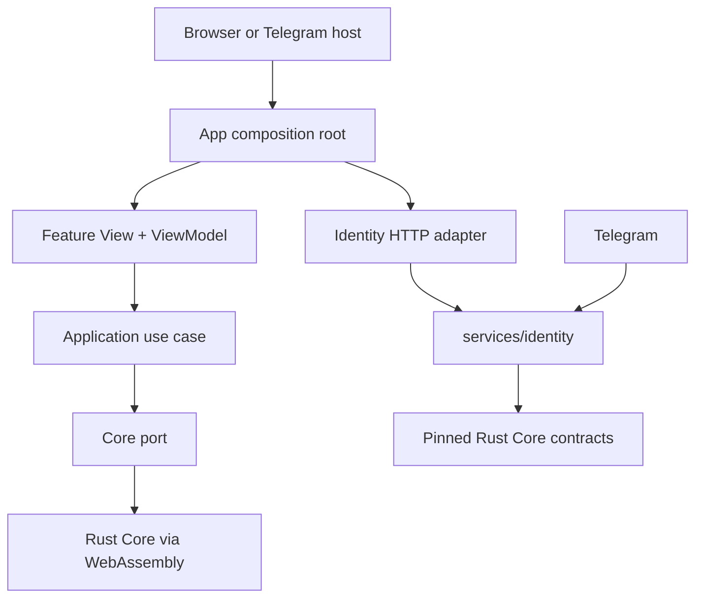

# Web Architecture

## Decision

0x1 Web uses **Clean Architecture across repository boundaries** and **MVVM inside presentation features**.

This is a composition, not two competing application architectures:

- Clean Architecture decides which layer may depend on which other layer;
- application use cases orchestrate ports without owning protocol rules;
- MVVM turns application projections into stable, testable view state;
- React views render that state and emit user intent;
- browser and messenger APIs enter only through host adapters;
- bounded server-side host services verify provider claims and keep provider secrets out of browser bundles;
- `nilx-one/core` remains the executable owner of shared protocol and product behavior.

VIPER is not the default for React features. Its Router and Presenter roles overlap with typed routing and MVVM view models, while its additional objects add little isolation at this stage. A feature may adopt a stricter interactor/presenter split later only when its complexity demonstrates the need.

## Dependency rule

Dependencies point inward:

| Scope                 | May depend on                                        | Must not own                                                                     |
| --------------------- | ---------------------------------------------------- | -------------------------------------------------------------------------------- |
| `application`         | no Web package                                       | BondChain completion, Relationship derivation, gamification, or other Core rules |
| `map-contract`        | no Web package                                       | MapLibre types, map assets, or world/protocol truth                              |
| `map-maplibre`        | `map-contract`, MapLibre GL JS                       | visibility, clustering, interaction, or Relationship semantics                   |
| `narration-contract`  | no Web package                                       | journal storage, cell derivation, model choice, or protocol truth                |
| `narration-templates` | `narration-contract`                                 | evidence of its own; it narrates what it is given and invents nothing            |
| `product-app`         | `application`, `host-contract`, `map-contract`, `ui` | host SDK access, renderer implementation details, or protocol decisions          |
| `ui`                  | React                                                | use cases, Core bindings, host behavior, or product state                        |
| `core-wasm`           | `application` ports                                  | presentation or host behavior                                                    |
| host adapters         | `host-contract`                                      | product flows or protocol authority                                              |
| `apps/*`              | composition dependencies                             | copied screens or business logic                                                 |
| `services/*`          | pinned Core contracts, provider SDKs, persistence    | protocol semantics, UI state, or browser-visible secrets                         |

The architecture test rejects forbidden internal imports and messenger-global access outside its adapter. Server-side services have their own language-level and deployment checks because they are not part of the browser dependency graph.

## Runtime composition



The arrow into WebAssembly is an adapter boundary. Until a versioned Core artifact exists, the adapter returns an explicit unavailable projection. The UI must not replace the missing behavior with TypeScript rules or sample relationship truth.

The server-side identity service is also an adapter boundary. It may verify Telegram evidence and persist a provider binding, but it may not redefine canonical `pub_dress` validation or infer protocol identity facts beyond the contract it consumes from Core.

## Host boundary

Every client host provides capabilities through `host-contract`:

- authentication envelope;
- theme and safe-area state;
- lifecycle events;
- back navigation;
- haptics;
- external links and sharing;
- device geolocation.

Device geolocation is a host capability, not renderer behavior and not
protocol truth. Shared application code never calls a platform geolocation API
directly, and the map renderer never requests a position: it draws an
observation the application supplies. Telegram and Discord run in embedded
browsers, so their compositions hand the same browser capability to the host
adapter rather than each growing one. A host without a provider composes the
canonical unsupported capability, so an absent provider is an answer rather
than a branch in the map feature.

An observed position is ephemeral evidence local to one client session. It may
drive local presentation and nothing else: it never becomes a BondChain entry,
never implies another Bond's presence or consent, never becomes Relationship or
Core state, and never reaches storage, a backend API, analytics, or `4x-errors`.
Explicit location sharing between Bonds would be a separate protocol feature.

Telegram `initData` and future native-app session envelopes are always marked as requiring verification at the client boundary. They become authentication context only after server-side validation. The fact that two hosts run on the same physical device is not authentication evidence. Passwordless continuation is allowed only when the backend verifies the host credential and resolves it to the exact selected identity. `TELOXIDE_TOKEN` exists only in the server-side identity runtime and must never enter Vite configuration, client JavaScript, static assets, or browser-visible environment state. Host availability changes presentation capability, never Core semantics.

The canonical production Web origin is `https://nilx.one`. Telegram Mini App authentication remains an ephemeral host envelope under `/telegram/`. Browser authentication uses the single flat route `/auth?provider=telegram` for both initiation and callback: absence of an authorization response starts the flow, while a returned `code` and `state` complete it. The auth router accepts only explicitly implemented provider values and fails closed for a missing, repeated, or unknown `provider`. Successful authentication becomes a server-managed same-origin session before the shared identity API accepts it. Both Telegram evidence forms must resolve to the same Telegram user identifier and therefore the same Stage 1 Bond identity; a browser login must never create a second provider namespace or identity record.

The bounded identity API remains same-origin under `/api/v1/*`. A separate API origin is not part of the current contract because it would add cross-origin and cookie policy without changing the identity boundary.

## State placement

Every persisted record has one of three placements, declared in `STATE_PLACEMENT` (`packages/application/src/state-placement.ts`) and checked against the source tree by an architecture test:

- **server** — the `pub_dress`, everything a sign-in needs, and the 3D-model identifier of a body. Nothing else is service state;
- **device** — never leaves the device: the on-device model and its download, the presence journal key, work in flight;
- **synchronizable** — local-first and eligible to follow a Bond between its own devices under the `.bnd` discipline: interface preferences, and what a Bond earned or remembered by playing (progress and levels, opened cells, position, `bch` and history).

See [State placement](state-placement.md) for the table and what "synchronizable" does and does not claim.

## Rendering boundary

Custom graphics select WebGPU by capability. Failure to acquire an adapter falls back to WebGL2. If neither is available, the feature exposes an unsupported state. There is no `CanvasRenderingContext2D` fallback.

Geographic rendering enters the product through `@nilx-one/map-contract`. `@nilx-one/map-maplibre` implements that port with MapLibre GL JS and is constructed only in the host composition roots. Product code never imports MapLibre directly.

The baseline style contract is the same-origin, versioned `/map/0.1.0/style.json`. The MapLibre adapter registers the PMTiles protocol as presentation infrastructure, while the immutable Web runtime serves `/map/*` from a host-independent static boundary. A style contract may be published before its geographic basemap archive; when that happens the style metadata must state the missing asset explicitly rather than silently substituting a public provider. Once a basemap is activated, its `.pmtiles` URL remains same-origin and versioned. Shared spatial state, visibility, clustering, permissions, and interaction projections must still arrive from Core-facing contracts rather than being invented by MapLibre or React.

The renderer also owns camera transitions and the presentation depth choice.
The application requests semantic camera changes — recenter on this coordinate,
with this viewport padding, animated or not — and MapLibre performs them; React
controls never call MapLibre directly. Presentation depth (`flat` or
`volumetric`) selects how the published style presents the same geography and
never forks the geographic model into two maps.

Camera synchronization with future custom world renderers may cross an explicit client-side coordination boundary, but no renderer may treat camera synchronization as authority over shared world state. Ownership, update direction, frame lifecycle, and versioning for that coordination remain an explicit architecture open item in the canonical 0x1 specification.

## Feature shape

Each product feature grows vertically:

```text
features/<feature>/
├── <feature>-view.tsx
├── <feature>-view-model.ts
└── <feature>-view-model.test.ts
```

Use cases and ports that are shared across presentation features live in `application`. Host-specific branches do not live in feature views or view models.

## Application shell

`product-app/src/shell` owns the viewport layout every feature is presented in: the world surface, the header, the single toast stack, the bottom-anchored Dock, and the overlay layer. It carries no domain state and no host branches, so a feature never re-implements navigation, anchoring, or safe-area handling. See [Web UI Shell](web-ui-shell.md) for the layout and navigation contract.

## Delivery

Every browser and Mini App entry point must pass the same formatting, lint, type, contract, integration, accessibility, and production-build gates. Server-side services pass their own full CI and deployability validation. Packaging produces immutable artifacts; merge and deployment remain separate, and production deployment is manual.

---

© 2026 aiaiaiai · aiaiaiai.org
